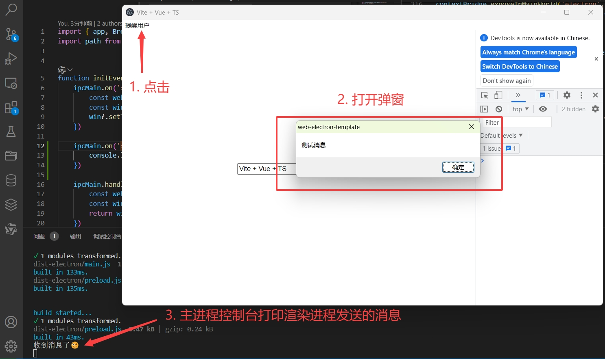

# Electron 进程间通信 IPC（Inter-Process Communication）

## 前言

首先，大家需要知道 Electron 是通过将 chrome Chromium 内核 和 Node.js 嵌入到一个二进制文件中来实现构建跨平台桌面应用的框架。
而因此原因，所以 Electron 应用同时具备操作 DOM、BOM 和 Node.js 的能力。

## Electron 中的进程

Electron 继承了 Chromium 的多进程架构，这使得该框架在架构上与现代 Web 浏览器非常相似

### 为什么是多进程架构？

这是因为 web 浏览器是极其复杂的应用。除了显示 Web 内容的主要能力之外，他们还有许多次要职责，例如管理多个窗口（或选项卡）和加载第三方扩展。
在早期，浏览器通常使用单个进程来实现所有这些功能。尽管这种模式意味着你打开的每个选项卡的开销更少，但这也意味着一个网站崩溃或挂起会影响整个浏览器。
总而言之，多进程架构使其应用更加稳定及安全，不会因为某个进程挂掉而是其他进程中的应用受到影响。

在 **Electron** 应用中主要分为 **主进程（main）** 跟 **渲染进程（renderer）**，他们分别为：

- 主进程：作为 **Electron** 应用的入口进程，它运行在 Node 环境中，因此它可以作为一个服务器给渲染进程提供调用系统级 API 的支持
- 渲染进程：负责渲染页面，运行在 chromium 浏览器内核中，可以调用浏览器提供的 WebAPI，它跟一个 chrome 浏览器没有任何区别

## 什么是进程？

1. 进程是操作系统能够独立执行的一个程序，每个进程都有自己的内存空间。
2. 进程是操作系统内核为应用程序分配的资源，包括内存、CPU 时间、I/O 设备等。
3. 进程间是相互独立的，互不影响的。
4. 进程间通信是进程间交互的一种方式。

## 安全问题

### nodeIntegration

### contextIsolation

### preload

为什么会有 preload ？出于安全原因，渲染器进程默认运行网页并且不运行 Node.js。所以为了将 Electron 的不同进程类型桥接在一起，我们需要使用一个称为预加载的特殊脚本。总而言之就是提供一个可以安全访问**系统 API** 的沙盒环境给渲染进程。

- preload 脚本中可以访问 WebAPI 以及有限的 Node.js 和 Electron API。

> 从 Electron 20 开始，预加载脚本默认被沙箱化，并且不再能够访问完整的 Node.js 环境。
>
> |    可用的 API     |                     细节                      |
> | :---------------: | :-------------------------------------------: |
> |   Electron 模块   |                 渲染进程模块                  |
> |    Node.js API    |              events、url、timers              |
> | Polyfill 全局变量 | Buffer、process、clearImmediate、setImmediate |

#### contextBridge

在 preload 脚本中，使用 contextBridge.exposeInMainWorld(apiKey, api) 或 contextBridge.exposeInIsolatedWorld(worldId,apiKey, api) 方法将 api 暴露给渲染进程。

> contextBridge.exposeInMainWorld(apiKey, api)

## 主进程

## 渲染进程

## 进程通信

### ipcMain

### ipcRenderer

## 通信模式

### 模式一 渲染进程 ==> 主进程（单向）

这种模式通常是渲染进程需要调用主进程的 api 做一些操作，而无需等待主进程的执行结果。例如下面一个动态修改窗口 title 的示例。

1. 使用 **ipcRenderer.send(channel, ...args)** 方法发送消息给主进程。
2. 在主进程（main.ts）中，使用 **ipcMain.on(channel, callback)** 方法监听消息。

```ts
// main.ts
import { ipcMain } from 'electron'

ipcMain.on("set-title", (event, title) => {
  const win = BrowserWindow.fromWebContents(event.sender);
  win?.setTitle(title);
});

// preload.ts
import { contextBridge, ipcRenderer } from 'electron'

contextBridge.exposeInMainWorld('electron', {
    setTitle: (title: string) => {
        ipcRenderer.send('set-title', title)
    }
})

// App.vue
<script setup lang="ts">
import { ref } from "vue";
const title = ref("App Title");

function setTitle() {
  window.electron.setTitle(title.value);
}
</script>

<template>
  <input type="text" v-model="title" />
  <button @click="setTitle">确认</button>
</template>

```

### 模式二 主进程 <==> 渲染进程

双向 IPC 的常见应用是从渲染器进程代码中调用主进程模块并等待结果。这可以通过使用 **ipcRenderer.invoke** 与 **ipcMain.handle** 配对来完成。将上诉代码在简单增加一个初始化时默认获取当前窗口的 title 的需求。

1. 使用 **ipcMain.handle** 监听渲染进程的 **ipcRenderer.invoke('get-title')** 事件
2. 在 preload 脚本将调用 **ipcRenderer.invoke('get-title')** 的调用结果返回给渲染进程
3. 在渲染进程调用 **window.electron.getTitle()** 获取窗口标题

```ts
// main.ts
import { ipcMain } from "electron";

ipcMain.on("set-title", (event, title) => {
  const win = BrowserWindow.fromWebContents(event.sender);
  win?.setTitle(title);
});

// +
ipcMain.handle("get-title", (event) => {
  const webContents = event.sender;
  const win = BrowserWindow.fromWebContents(webContents);
  return win?.getTitle();
});

// preload.ts
import { contextBridge, ipcRenderer } from "electron";

contextBridge.exposeInMainWorld("electron", {
  setTitle: (title: string) => {
    ipcRenderer.send("set-title", title);
  },

// +
  getTitle: () => {
    return ipcRenderer.invoke("get-title");
  },
});

// App.vue
<script setup lang="ts">
import { ref } from "vue";
const title = ref("App Title");

function setTitle() {
  window.electron.setTitle(title.value);
}

// +
window.electron.getTitle().then((value) => {
  title.value = value;
});

</script>

<template>
  <input type="text" v-model="title" />
  <button @click="setTitle">确认</button>
</template>
```

ipcRenderer.invoke 是 electron 7 中添加的新 api，也可以使用 ipcRenderer.send 跟 ipcRenderer.sendSync 来实现双向通信，但并不推荐。其原因便是开发代码的冗余跟同步代码带来的性能阻塞问题。[参考](https://www.electronjs.org/zh/docs/latest/tutorial/ipc#%E6%B3%A8%E6%84%8F%E5%AF%B9%E4%BA%8E%E6%97%A7%E6%96%B9%E6%B3%95)

### 模式三 主进程 ==> 渲染进程

当从主进程向渲染器进程发送消息时，需要指定哪个渲染器正在接收该消息。消息需要通过渲染器进程的 **WebContents** 实例发送到渲染器进程。此 WebContents 实例包含一个 **send** 方法，其使用方式与 **ipcRenderer.send** 相同。以下用一个提醒用户的测试用例展示：

1. 使用 **Menu.buildFromTemplate** 添加一个 "提醒用户" 的菜单按钮，并添加 **send** 事件
2. preload 中添加 **onMessage** 函数暴露给渲染进程监听主进程发起的信息。
3. renderer 中调用 **window.electron.onMessage()**
4. 还可以在 preload 中添加 **sendMessage** 函数来给主进程回复消息，当然，这不是必须的。

```ts
// main.ts
const win = new BrowserWindow({
  width: 960,
  height: 600,
  webPreferences: {
    preload: path.join(__dirname, "./preload.js"),
    nodeIntegration: false, // 设置是否在页面中启用 Node.js 集成模式
    contextIsolation: true, // 设置是否启用上下文隔离模式。
  },
});


ipcMain.on('send-message', (_, message) => {
  console.log(message) // 打印："收到消息了😉"
})

const menu = Menu.buildFromTemplate([
  {
    label: "提醒用户",
    click: () => {
      win.webContents.send("send-message", "测试消息");
    },
  },
]);

win.setMenu(menu);

// preload.ts
import { contextBridge, ipcRenderer } from 'electron'

contextBridge.exposeInMainWorld('electron', {
    onMessage: (callback: (...args: any[]) => void) => {
        ipcRenderer.on('send-message', (_, ...args) => callback(...args))
    }
    sendMessage: (message: string) => {
        ipcRenderer.send('sand-message', message)
    }
})

// App.vue
window.electron.onMessage((value) => {
  window.alert(value);
  window.electron.sendMessage("收到消息了😉")
});

```



### 模式四 渲染进程 1 <==> 渲染进程 2

没有直接的方法可以使用 ipcMain 和 ipcRenderer 模块在 Electron 中的渲染进程之间发送消息。想要实现这种模式，有两种选择：

- 使用主进程作为渲染进程之间的消息代理，由渲染进程像主进程发送消息，在由主进程将消息转发到另一个渲染进程。
- 使用 [MessagePort](https://electron.nodejs.cn/docs/latest/tutorial/message-ports) 从主进程传递到两个渲染器。这将允许在初始化后渲染器之间进行直接通信。

 [MessageChannel API](https://developer.mozilla.org/zh-CN/docs/Web/API/MessageChannel)
